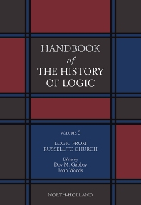
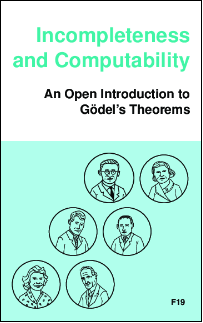
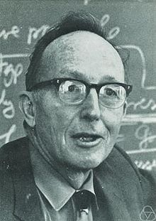

 **Raymond M. Smullyan (1919 – 2017)** :

<table>
<tr>
<th><a>A Beginner's Guide to Mathematical Logic</a></th>
<th><a>A Beginner's Further Guide to Mathematical Logic</a></th>
</tr>
<tr>
<td><a>

</a></td>
<td><a>

</a></td>
</tr>
</table>

### 著述：

<table>
<tr>
<th><a>郝兆宽、杨睿之、杨跃</a></th>
<th><a>张再跃 张晓如</a></th>
<th><a>王浩（1921 — 1995）</a></th>
<th><a>冯琦</a></th>
<th><a>徐明</a></th>
<th><a>杨睿之</a></th>
</tr>
<tr>
<td></td>
<td></td>
<td></td>
<td></td>
<td></td>
<td></td>
</tr>
<tr>
<th><a>陆钟万</a></th>
<th><a>陆汝钤</a></th>
<th><a>张家龙</a></th>
<th><a>(译)张卜天</a></th>
<th><a>(译)郝兆宽/杨睿之</a></th>
</tr>
<tr>
<td></td>
<td></td>
<td></td>
<td></td>
<td><a>

</a></td>
</tr>
</table>

### 课程：

| 学校 | 课程 | 授课 |
|:-----:|:----:|:----:|
| Oregon  | [Summer School](https://www.cs.uoregon.edu/research/summerschool/archives.html) |  |
| 复旦大学 | <u>[Mathematical Logic](http://logic.fudan.edu.cn/)</u>  | ...[杨睿之](https://aplacenearby.ggr.fun)...|
| 南京大学  | <u>[Mathematical Logic](https://yiqinnju.github.io/course/MathLogic/MathLogic.html) |  ...[秦逸](https://yiqinnju.github.io/)...|
| 北京大学 |  http://wangyanjing.com/teaching/ | 王彦晶|
| 南京大学  | https://sites.google.com/view/yuliang | 喻良 |
| 臺灣大學 |[邏輯、語言與計算暑期研習營](https://flolac.iis.sinica.edu.tw/zh/2020/index.html) |[穆信成](https://scm.iis.sinica.edu.tw/ncs/) |
| Stanford | [CS103: Mathematical Foundations of Computing](https://web.stanford.edu/class/archive/cs/cs103/cs103.1132/) | 2012  |
| Washington  | [CSE431: Introduction to Theory of Computation](http://courses.cs.washington.edu/courses/cse431/) |  |
| Washington | [CSEP531: Computability and Complexity Theory](http://courses.cs.washington.edu/courses/csep531/) | 2009/2016 |
| Washington | [CSE531: Computational Complexity I](https://courses.cs.washington.edu/courses/cse531/) |  |
| Washington  | [CSE532: Complexity Theory](https://courses.cs.washington.edu/courses/cse532/)  |   |
| Washington | [CSE533: Advanced Topics in Complexity Theory](https://courses.cs.washington.edu/courses/cse533/) |  |

### [Handbook of the History of Logic](https://www.elsevier.com/books/book-series/handbook-of-the-history-of-logic)：

<table>
<tr>
<th>Greek, Indian and Arabic Logic, Volume 1</th>
<th>Mediaeval and Renaissance Logic, Volume 2</th>
<th>The Rise of Modern Logic: from Leibniz to Frege, Volume 3</th>
<th>British Logic in the Nineteenth Century, Volume 4</th>
<th>Logic from Russell to Church, Volume 5</th>
<th>Sets and Extensions in the Twentieth Century, Volume 6</th>
</tr>
<tr>
<td>

</td>
<td>

</td>
<td>

</td>
<td>

</td>
<td>

</td>
<td>

</td>
</tr>
<tr>
<th>Logic and the Modalities in the Twentieth Century, Volume 7</th>
<th>The Many Valued and Nonmonotonic Turn in Logic, Volume 8</th>
<th>Computational Logic, Volume 9</th>
<th>Inductive Logic, Volume 10</th>
<th>Logic: A History of its Central Concepts, Volume 11</th>
</tr>
<tr>
<td>

</td>
<td>

</td>
<td>

</td>
<td>

</td>
<td>

</td>
</tr>
</table>

### Books：

<table>
<tr>
<td></td>
<td></td>
<td></td>
<td><a href="http://math.hws.edu/FoundationsOfComputation/"></td>
</tr>
</table>

### <u>[An Open-Source, Collaborative Logic Text](https://openlogicproject.org) & [**PDFs**](https://builds.openlogicproject.org)</u>：

<table>
<tr>
<td></td>
<td></td>
<td></td>
<td></td>
</tr>
</table>

### [Software Foundations](https://softwarefoundations.cis.upenn.edu) & <u>Chinese『[软件基础](https://coq-zh.github.io/SF-zh/)』</u>:

 <a href="https://www.cis.upenn.edu/~bcpierce/">

<table>
<tr>
<th><a href="https://softwarefoundations.cis.upenn.edu/lf-current/index.html">Logical Foundations</th>
<th><a href="https://softwarefoundations.cis.upenn.edu/plf-current/index.html">Programming Language Foundations</th>
<th><a href="https://softwarefoundations.cis.upenn.edu/vfa-current/index.html">Verified Functional Algorithms</th>
<th><a href="https://softwarefoundations.cis.upenn.edu/qc-current/index.html">QuickChick: Property-Based Testing in Coq</th>
<th><a href="https://softwarefoundations.cis.upenn.edu/vc-current/index.html">Verifiable C</th>
</tr>
<tr>
<td>
<a href="https://softwarefoundations.cis.upenn.edu/lf-current/index.html">
</td>
<td>
<a href="https://softwarefoundations.cis.upenn.edu/plf-current/index.html">
</td>
<td>
<a href="https://softwarefoundations.cis.upenn.edu/vfa-current/index.html">
</td>
<td>
<a href="https://softwarefoundations.cis.upenn.edu/qc-current/index.html">
</td>
<td><a href="https://softwarefoundations.cis.upenn.edu/vc-current/index.html"></td>
</tr>
<tr>
<th><a href="https://coq-zh.github.io/SF-zh/lf-current/index.html">《逻辑基础》</a></th>
<th><a href="https://coq-zh.github.io/SF-zh/plf-current/index.html">《编程语言基础》</a></th>
<th><a href="https://coq-zh.github.io/SF-zh/vfa-current/index.html">《函数式算法验证》</a></th>
<th><a href="https://coq-zh.github.io/SF-zh/qc-current/index.html">《QuickChick：用 Coq 进行基于性质的测试》</a></th>
</tr>
<tr>
<td></td>
<td>
<a href="https://coq-zh.github.io/SF-zh/plf-current/index.html">
</a></td>
<td>
<a href="https://coq-zh.github.io/SF-zh/vfa-current/index.html">
</a></td>
<td>
<a href="https://coq-zh.github.io/SF-zh/qc-current/index.html">
</a></td>
</tr>
</table>

<table>
<tr>
<th><a href="https://plfa.github.io/">Programming Language Foundations in Agda</a></th>
<th><a href="https://agda-zh.github.io/PLFA-zh/">编程语言基础:Agda语言描述</a></th>
</tr>
<tr>
<td><a href="https://plfa.github.io/">

</a></td>
<td><a>https://agda-zh.github.io/PLFA-zh/</a></td>
</tr>
</table>

### 博文：

[Computational Complexity —— Computational Complexity and other fun stuff in math and computer science from Lance Fortnow and Bill Gaserch](https://blog.computationalcomplexity.org/)

> 赛义甫：[组合子逻辑、λ演算的历史背景和产生动机](http://blog.sciencenet.cn/blog-2349385-1041724.html)

> [逻辑](https://site.douban.com/145723/) (豆瓣小站)

> [现代形式语法理论](https://site.douban.com/249348/) (豆瓣小站)

[Logic Matters](https://www.logicmatters.net) :
- Peter Smith's [Logic Matters blog](https://www.logicmatters.net/blogfront)
- [An Introduction to Formal Logic](https://www.logicmatters.net/ifl)
- [Godel's Theorems](https://www.logicmatters.net/igt)
- [Categories](https://www.logicmatters.net/categories)
- [Teach Yourself Logic](https://www.logicmatters.net/tyl)
- [Notes and Papers](https://www.logicmatters.net/yet-more-logic)
- [Logical snippets/advice for students](https://www.logicmatters.net/students)
- [LaTeX for Logicians](https://www.logicmatters.net/latex-for-logicians)

[Xixi Logic](https://www.xixilogic.org/) Seminars is run by the logic group at Zhejiang University. 

<u>The Road to Modern Logic - an interpretation</u>     |     Jose Ferreiros 

#### <u>*Mathematical Logic in Computer Science*</u> by Assaf Kfoury

#### <u>*On the Unusual Effectiveness of Logic in Computer Science*</u>   

**[The Bulletin of Symbolic Logic](https://dblp.org/db/journals/bsl/index.html)** 

### History:

| | | |
|:---:|:-----:|---:|
| René Descartes|[1596~1650](https://en.wikipedia.org/wiki/Ren%C3%A9_Descartes)||
| Gottfried Leibniz | [1646~1716](https://en.wikipedia.org/wiki/Gottfried_Wilhelm_Leibniz)| 
| George Boole |[1815~1864](https://en.wikipedia.org/wiki/George_Boole)|
| Georg Cantor |[1845~1918](https://en.wikipedia.org/wiki/Georg_Cantor)||
|  Gottlob Frege |[1848~1925](https://en.wikipedia.org/wiki/Gottlob_Frege)||
| Giuseppe Peano |[1858~1932](https://en.wikipedia.org/wiki/Giuseppe_Peano)||
| David Hilbert| [1862~1943](https://en.wikipedia.org/wiki/David_Hilbert)||
| Bertrand Russell |[1872~1970](https://en.wikipedia.org/wiki/Bertrand_Russell)||
| C. I. Lewis|[1883~1964](https://en.wikipedia.org/wiki/C._I._Lewis)||
|  Moses Schönfinkel| [1888~1942](https://en.wikipedia.org/wiki/Moses_Sch%C3%B6nfinkel)  |   |
| Paul Rudolf Carnap|[1891~1970](https://en.wikipedia.org/wiki/Rudolf_Carnap)||
| Emil Post| [1897~1954](https://en.wikipedia.org/wiki/Emil_Leon_Post)||
| Haskell Curry |[1900~1982](https://en.wikipedia.org/wiki/Haskell_Curry)||
| Alfred Tarski | [1901~1983](https://en.wikipedia.org/wiki/Alfred_Tarski) ||
| Alonzo Church |[1903~1995](https://en.wikipedia.org/wiki/Alonzo_Church)||
| Kurt Godel |[1906~1978](https://en.wikipedia.org/wiki/Kurt_G%C3%B6del)||
|  J. Barkley Rosser|[1907~1989](https://en.wikipedia.org/wiki/J._Barkley_Rosser)  |  |
| Jacques Herbrand|[1908~1931](https://en.wikipedia.org/wiki/Jacques_Herbrand)||
| Stephen Kleene| [1909~1994](https://en.wikipedia.org/wiki/Stephen_Cole_Kleene)||
| Gerhard Gentzen |[1909~1945](https://en.wikipedia.org/wiki/Gerhard_Gentzen)||
|  Saunders Mac Lane | [1909~2005](https://en.wikipedia.org/wiki/Saunders_Mac_Lane) ||
| Alan Turing| [1912~1954](https://en.wikipedia.org/wiki/Alan_Turing)||
| Raymond Merrill Smullyan|[1919~2017](https://en.wikipedia.org/wiki/Raymond_Smullyan)||
| Hao Wang 王浩| [1921~1995](https://en.wikipedia.org/wiki/Hao_Wang_(academic))||
| William Alvin Howard|born [1926](https://en.wikipedia.org/wiki/William_Alvin_Howard)||
| Martin Davis|born [1928](https://en.wikipedia.org/wiki/Martin_Davis_(mathematician))||
| Heinrich Kleisli | [1930~2011](https://en.wikipedia.org/wiki/Heinrich_Kleisli)   | |
|   Dana Scott|born [1932](https://en.wikipedia.org/wiki/Dana_Scott)||
| Robin Milner|[1934~2010](https://en.wikipedia.org/wiki/Robin_Milner)||
| John C. Reynolds [CMU Page](https://www.cs.cmu.edu/~jcr/)|[1935~2013](https://en.wikipedia.org/wiki/John_C._Reynolds)||
| J. Roger Hindley |born [1939](https://en.wikipedia.org/wiki/J._Roger_Hindley)||
|  Stephen Cook [Toronto Page](http://www.cs.toronto.edu/~sacook/)|born [1939](https://en.wikipedia.org/wiki/Stephen_Cook)||
|   Per Martin-Löf|born [1942](https://en.wikipedia.org/wiki/Martin-L%C3%B6f)||
| Jean-Yves Girard|born [1947](https://en.wikipedia.org/wiki/Jean-Yves_Girard)||
    
